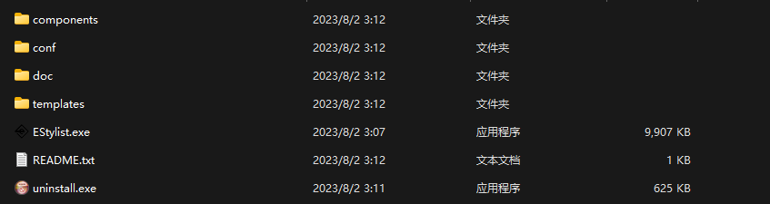

 

# EStylist

- author：syf20020816@outlook.com
- docName：EStylist README
- createDate：20230619
- updateDate：20230801
- version：0.1.0
- des-tag：release
- email：syf20020816@outlook.com

## Why EStylist

邮件服务公司通常不会在软件中构建邮件模板服务，因为这会增加他们的开发成本和维护成本。此外，邮件模板服务需要大量的数据管理和安全措施，以确保用户的隐私和数据安全。相反，许多邮件服务公司提供了API和SDK,使得开发人员可以轻松地集成邮件模板服务到他们的应用程序中。这些API和SDK通常提供了一系列功能，如发送电子邮件、管理收件人列表、设置主题、添加附件等。但这对于普通人想要构建一个精美的模板而言显得较为困难，也几乎找不到提供的API或SDK进行发布。

Email service companies typically do not build email template services in their software, as this increases their development and maintenance costs. In addition, email template services require extensive data management and security measures to ensure user privacy and data security. On the contrary, many email service companies provide APIs and SDKs, allowing developers to easily integrate email template services into their applications. These APIs and SDKs typically provide a series of functions, such as sending emails, managing recipient lists, setting themes, and adding attachments. But this is relatively difficult for ordinary people to build a beautiful template, and there is almost no API or SDK provided for publishing.

## What is EStylist

EStylist 是一款第三方应用软件，旨在帮助用户编写邮件模板。无论是商务邮件、求职信、感谢信还是其他类型的邮件，EStylist 都可以提供专业的模板和编辑功能，让用户能够轻松地撰写出富有表达力和专业感的邮件。如果你经常被丑陋的电子邮件所困扰，并想追求电子邮件的布局和风格。想要像Stream或GitHub那样精致的电子邮件，EStylist将帮助您构建精美的电子邮件！

EStylist is a third-party application designed to assist users in writing email templates. EStylist can provide professional templates and editing functions for business emails, Cover letter, thank-you letters and other types of emails, so that users can easily write expressive and professional emails. If you are often troubled by ugly emails and want to pursue the layout and style of emails. If you want exquisite emails like Stream or GitHub, EStylist will help you build exquisite emails!

## License

## Download EStylist

下载EStylist十分简单，你可以前往Gitee或者GitHub上直接进行下载exe文件，然后将exe放到自己喜欢的目录下直接启动即可，程序会帮助您构建需要的文件以及目录。

Downloading EStylist is very simple. You can go to Gitee or GitHub to download the exe file directly, and then place the exe in your favorite directory to start directly. The program will help you build the necessary files and directories.

## Directory Structure

## How To Use EStylist

- You can read GitHub or Gitee wiki : https://github.com/syf20020816/EStylist/wiki
- Clicking on the document icon in the program can also read and use the document
