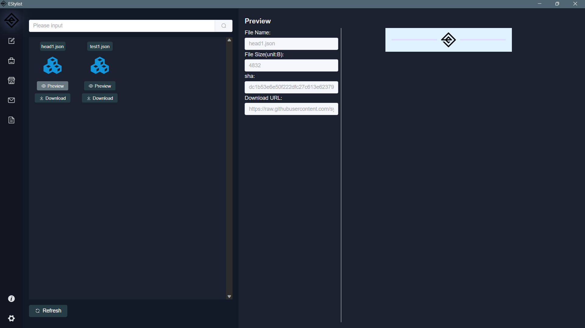

# 贡献 Contribute

作为开发者，我将在资源仓库中提供一些模板和组件，但毕竟个人的能力是有限的，希望软件的使用者也可以贡献一份力量，当然这全凭自愿，也全都免费，这意味着下载的用户和上传的用户也都没有任何支出和收入。

As a developer, I will provide some templates and components in the resource repository, but after all, my personal abilities are limited. I hope that users of the software can also contribute, of course, all of this is voluntary and free, which means that both downloaded and uploaded users have no expenses or income.

资源仓库地址：https://github.com/syf20020816/EStylist-TemplateLib

作为软件的使用者，您可以在软件中的组件商店和模板商店直接下载资源仓库中所有的资源到本地使用

As a user of the software, you can directly download all resources in the resource repository from the component store and template store in the software for local use



## 如何贡献（How To Contribute）

1. 选择你要贡献的组件或模板对应的html文件和json文件
2. 编写一个`README.txt`或`README.md`( 编写内容请复制下面并进行修改)
3. 以附件的形式发送给我（syf20020816@outlook.com）
4. 我将在1~2个工作日给予回复，并将您的组件上传至资源仓库
5. 非常感谢您的支持

1. Select the HTML and JSON files corresponding to the components or templates you want to contribute
2. Write a `README. txt` or `README. md` (please copy and modify the content below)
3. Send it to me as an attachment（ syf20020816@outlook.com ）
4. I will reply within 1-2 working days and upload your components to the resource warehouse
5. Thank you very much for your support

## README.md|README.txt

```markdown
- email : your email(你的邮箱)
// if your contribution is a template => true
// 如果您的贡献物是一个模板 => true
- isTemplate : true or false
// Optional, if you have a Github account
// 可选，若您有Github账号的话
- githhub? : your github account or address
```

