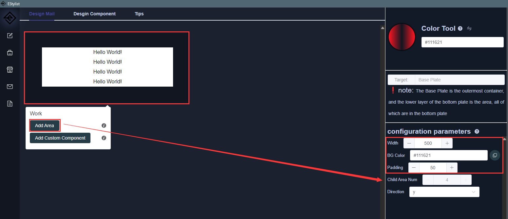
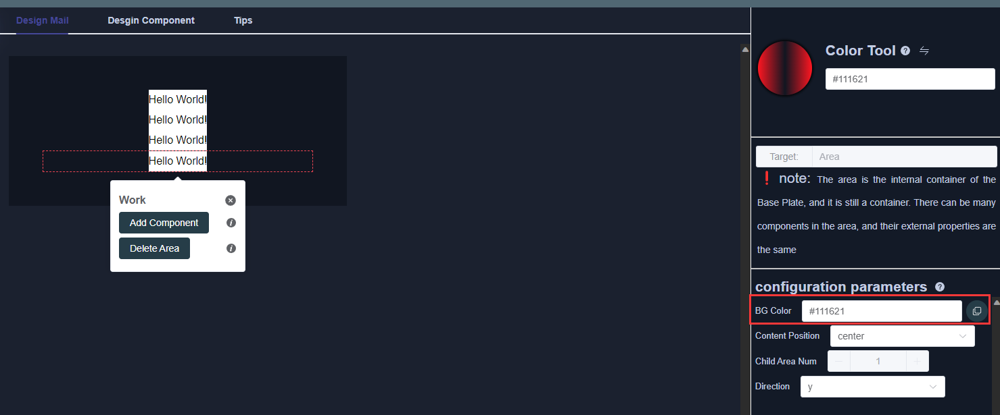
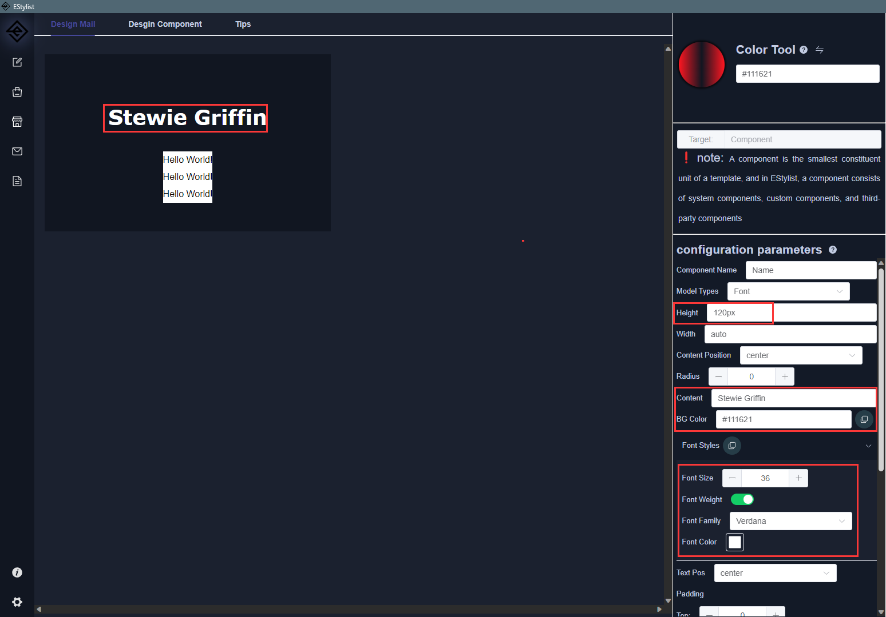
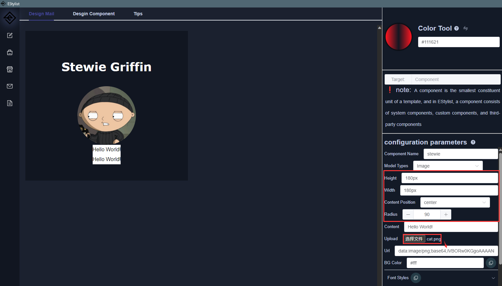
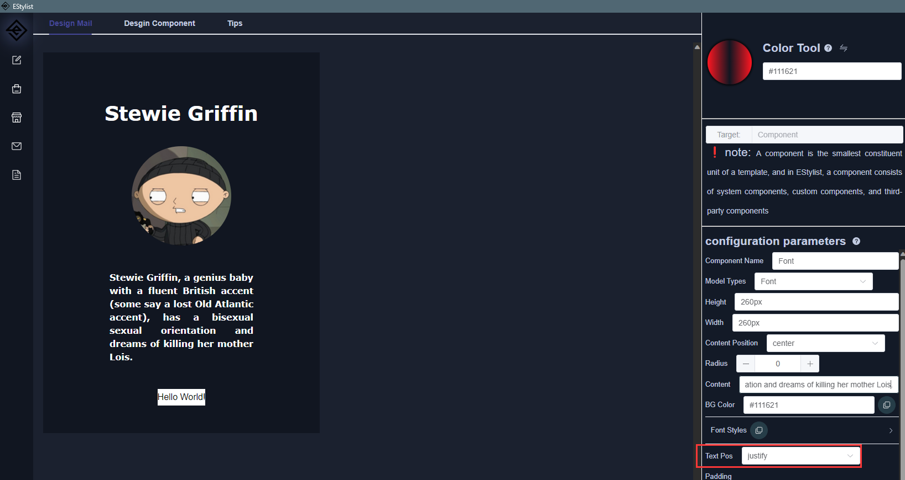
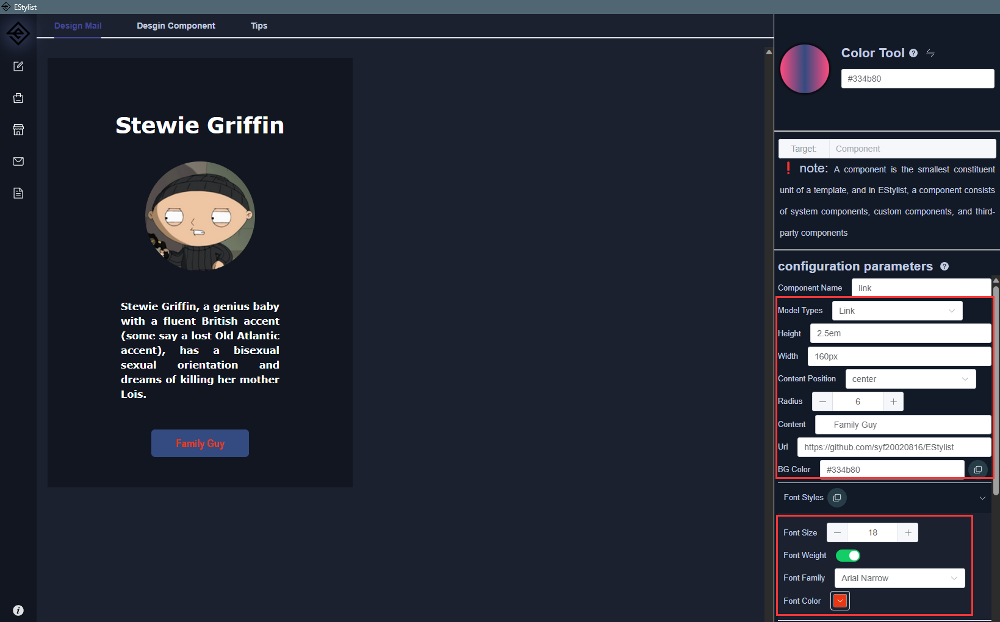
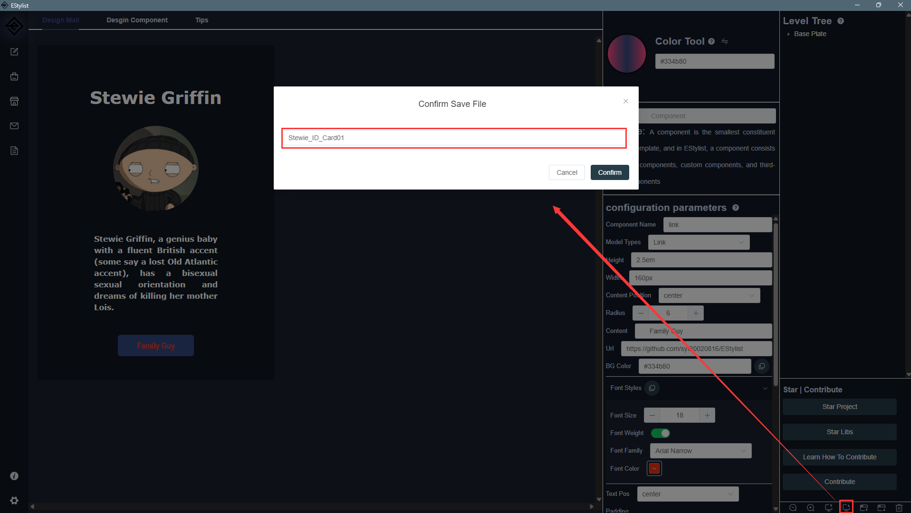
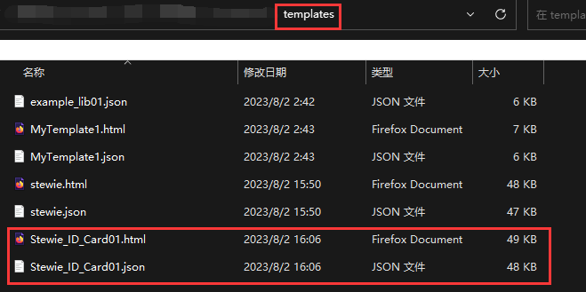
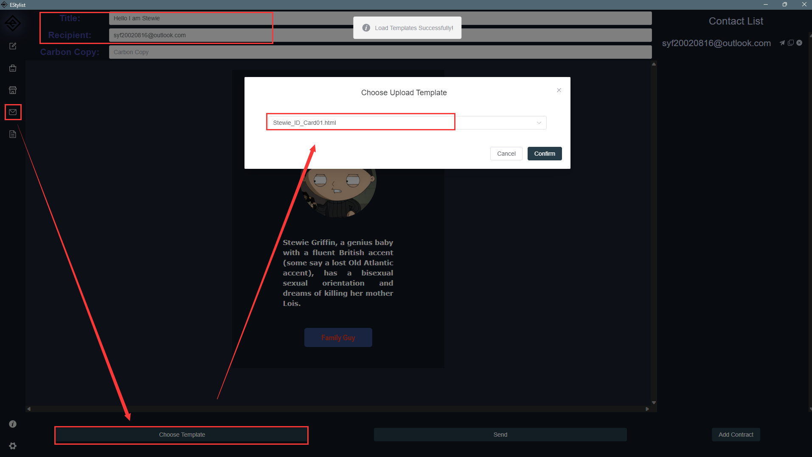
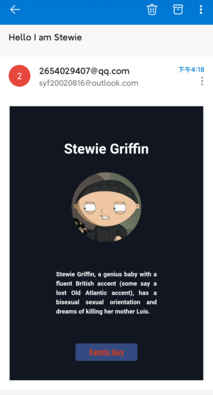

# 案例1：个人卡片（Example1：Personal Card ）

## Step1：设置底板（Set Base Plate）

第一步设置底板的配置属性，首先选择底板，我添加了四个区域，并且设置宽度为500个像素，修改了背景色和内边距，使得现在底板的实际宽度为600（500+50+50）

The first step is to set the configuration properties of the base plate. First, select the base plate. I added four areas and set the width to 500 pixels. I also modified the background color and inner margin to make the actual width of the base plate 600 (500+50+50)

## Step2：将所有区域颜色统一（Same all Area BG Color）

## Step3：修改组件（Modify Component）

### 1.设置名字（Set Card Name）

这里我更改了高度，文字属性和背景色

I have changed the height, text attributes, and background color here

### 2.设置图片（Set Image）

首先上传一个图片，我将图片的高度和宽度设置为相等，然后将圆角属性设置超过高度的一半，这样图片就变成一个圆了

First, upload an image. I set the height and width of the image to be equal, and then set the rounded corner property to exceed half the height. This will make the image a circle

### 3.长文本对齐（Long Text alignment）

这里当我们使用长文本时则可以使用`justify`进行文本对齐

Here, when we use long text, we can use `justify` for text alignment

### 4.制作一个像是按钮的链接(make a link as button)

选择组件后切换为链接类型，修改背景色，宽度，高度，字体很快就能获得一个像按钮一样的链接，别忘了加上Url属性，这样别人受到邮件后点击就能直接跳转

After selecting the component, switch to the link type, modify the background color, width, height, and font to quickly obtain a button like link. Don't forget to add the Url attribute, so that when someone receives an email, they can click to directly jump to it

## Step4：保存邮件模板（Save mail template）

点击选择右下角下载模板按钮输入名字即可保存到软件的templates目录中，其中包含一个html文件，这个文件你可以直接在浏览器中查看模板生成的效果

Click the download template button in the bottom right corner and enter the name to save it to the software's templates directory, which contains an HTML file that you can directly view in the browser to generate the template's effect

## Step5：发送邮件（Send Email）

选择发送邮件窗口，然后选择模板，设置好邮件名称和发送者之后直接就可以发送了！

Select the send email window, then select the template, set the email name and sender, and you can send it directly!

## 结果（Res）

