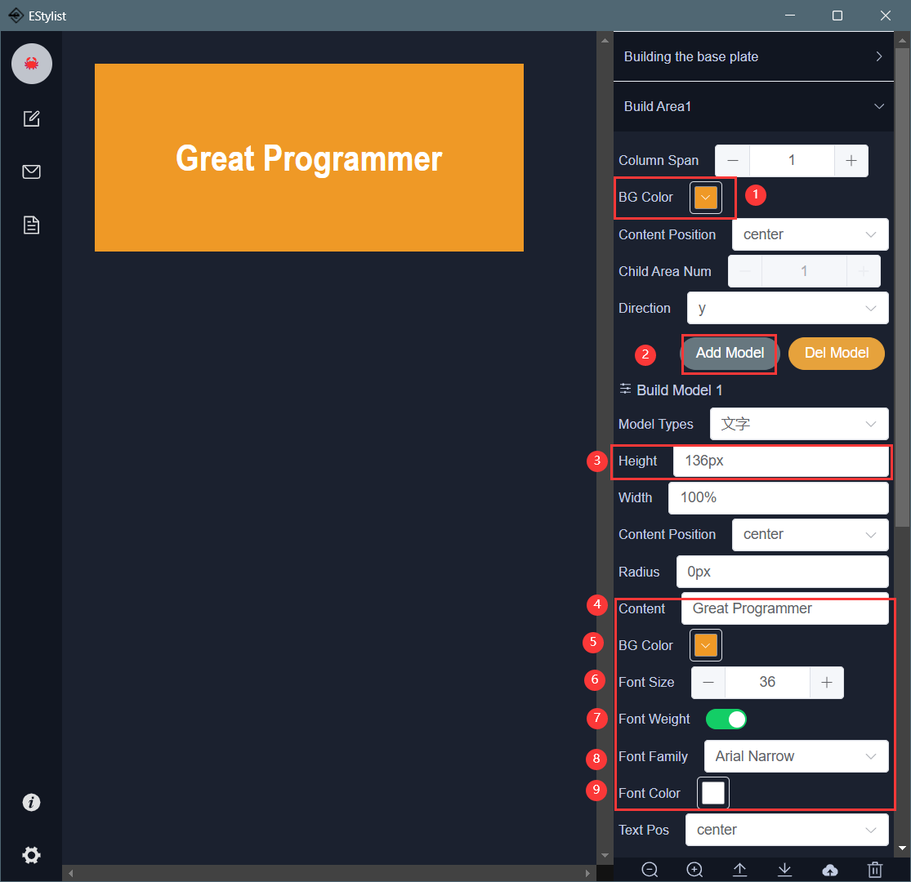
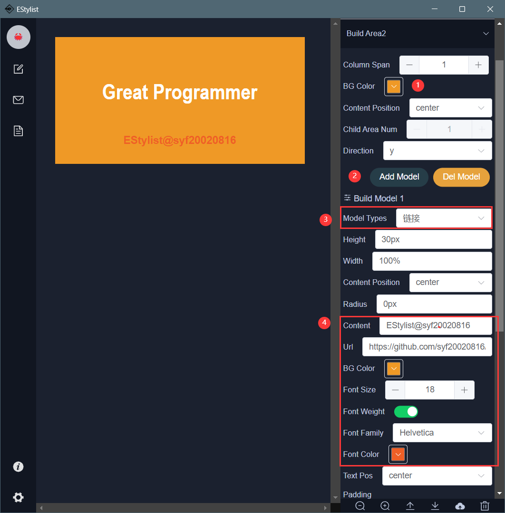
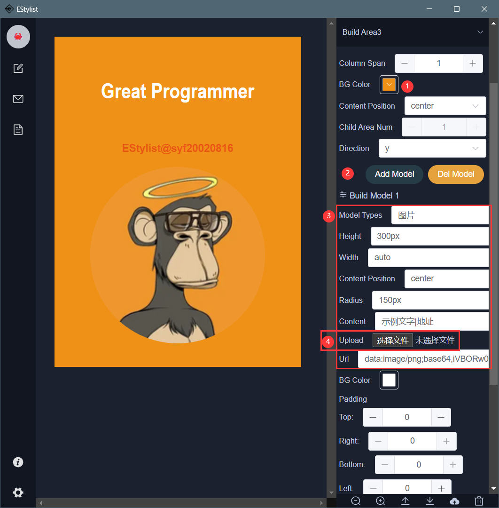
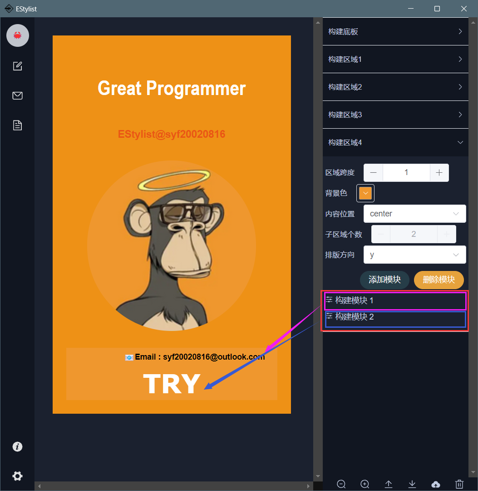
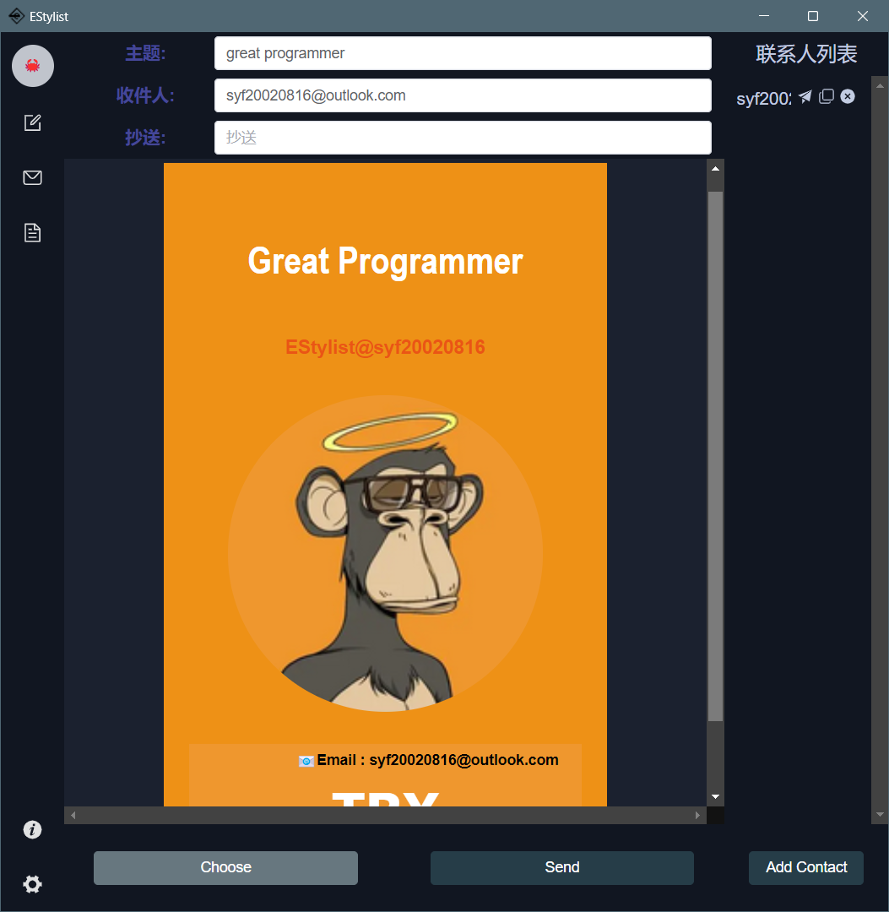

# Example：Personal Card（v0.0.2）

你可以选择看v0.0.1的例子，那同样十分优秀，不过这取决于你

You can choose to look at the example of v0.0.1, which is also excellent, but it depends on you

> ❗note：
>
> 更高的版本出于用户体验去除了一些冗余属性The higher
>
>  version removes some redundant attributes due to user experience

## Build the base plate

第一步，修改底板中的宽度、背景色、内边距以及子区域个数，然后点击修改区域数量

The first step is to modify the width, background color, padding, and number of sub areas in the base plate,then click change area num button


## Add Title

打开区域1，修改背景色并添加一个模块，在模块中响应对文字模块的高度，内容，背景色，文字颜色，文字大小进行修改

Open Area 1, modify the background color and add a module that responds to the height, content, background color, text color, and text size of the text module



## Add Link

选择使用链接，设置链接文字，然后设置链接地址，当然emoji表情😎你也可以使用

Choose to use links, set the link text, and then set the link address, of course emoji emoji emoji 😎 You can also use



## Add Picture



## More Models

事实上你可以在一个区域内创建多个模块，并修改方向控制模块沿着x轴或y轴排序

In fact, you can create multiple modules within an area and modify the direction control module to sort along the x or y axis



### JSON File

你可以将json文件导入到编辑，然后自己查看设置

You can import the JSON file into the editor and view the settings yourself

当然这里我去除了图片

Of course, I removed the image here

```json
{"base":{"width":420,"bgColor":"#EE9116","areaNum":4,"direction":"y","padding":24},"areas":[{"id":0,"bgColor":"#EE9116","direction":"y","textAlign":"center","span":1,"justifyContent":"center","modelItem":[{"id":0,"type":"div","height":"136px","width":"100%","bgColor":"#EE9116","fontSize":36,"fontColor":"#FFFFFF","fontFamily":"Arial Narrow","textAlign":"center","direction":"x","fontWeight":true,"padding":[0,0,0,0],"margin":[0,0,0,0],"content":"Great Programmer","borderRadius":"0px","justifyContent":"center","src":""}]},{"id":1,"bgColor":"#EE9116","direction":"y","textAlign":"center","span":1,"justifyContent":"center","modelItem":[{"id":0,"type":"a","height":"30px","width":"100%","bgColor":"#EE9116","fontSize":18,"fontColor":"#EA5515","fontFamily":"Helvetica","textAlign":"center","direction":"x","fontWeight":true,"padding":[0,0,0,0],"margin":[0,0,30,0],"content":"EStylist@syf20020816","borderRadius":"0px","justifyContent":"center","src":"https://github.com/syf20020816/EStylist"}]},{"id":2,"bgColor":"#EE9116","direction":"y","textAlign":"center","span":1,"justifyContent":"center","modelItem":[{"id":0,"type":"img","height":"300px","width":"auto","bgColor":"#fff","fontSize":16,"fontColor":"#000","fontFamily":"Helvetica","textAlign":"center","direction":"x","fontWeight":false,"padding":[0,0,0,0],"margin":[0,0,30,0],"content":"示例文字|地址","borderRadius":"150px","justifyContent":"center","src":""}]},{"id":3,"bgColor":"#EF972E","direction":"y","textAlign":"center","span":1,"justifyContent":"center","modelItem":[{"id":0,"type":"div","height":"32px","width":"100%","bgColor":"#EF972E","fontSize":14,"fontColor":"#000","fontFamily":"Arial","textAlign":"left","direction":"x","fontWeight":true,"padding":[0,0,0,0],"margin":[0,0,0,40],"content":"📧Email : syf20020816@outlook.com","borderRadius":"0px","justifyContent":"center","src":""},{"id":1,"type":"div","height":"60px","width":"100%","bgColor":"#EF972E","fontSize":46,"fontColor":"#FFFFFF","fontFamily":"Verdana","textAlign":"center","direction":"x","fontWeight":true,"padding":[0,0,0,0],"margin":[0,0,0,0],"content":"TRY","borderRadius":"0px","justifyContent":"center","src":""}]}],"areasLen":4}
```

## Send Email

最后我们到发送页面，点击选择按钮，选择我们需要的模板，设置好邮件名称和收件人您就可以发送了

Finally, we will go to the send page, click the select button, select the template we need, set the email name and recipient, and you can send it



# Example：invitation letter （v0.0.1）

接下来，我们将学习一个例子来验证学习成果！

Next, we will learn an example to verify the learning outcomes!

## Build the base plate

第一步，修改底板中的宽度、背景色、内边距以及子区域个数

The first step is to modify the width, background color, padding, and number of sub areas in the base plate


## Add Logo

接下来在区域中添加模块，设置模块类型为图片，修改高度、宽度、并选择一个你的Logo图片，并修改背景色

Next, add a module to the area, set the module type to Image, modify the height and width, choose a logo image, and modify the background color


但是我们发现有白色的区域，这时候我们就需要到当前的区域中修改区域的背景色即可

But we found a white area, so we need to modify the background color of the area in the current area


## Add Text

接下来到第二个区域中添加模块，选择模块类型为文字，修改文字内容、模块的高度、背景色、文字颜色

Next, add a module to the second area, select the module type as text, modify the text content, module height, background color, and text color


下面为了对齐文字，我们需要将文字位置改为justify

To align the text below, we need to change the text position to justify


## Add Link

选择使用链接，设置链接文字，然后设置链接地址，当然emoji表情😎你也可以使用

Choose to use links, set the link text, and then set the link address, of course emoji emoji emoji 😎 You can also use


## Download Template

完成模板后我们就可以将模板下载到本地进行保存以便于后续的编辑或发送模板

After completing the template, we can download it locally and save it for future editing or sending


我们点击保存按钮，并设置名称，完成后我们在templates目录下就可以看到两个文件，分别是json和html格式的，html格式支持您直接进行预览

We click the save button and set the name. After completion, we can see two files in the templates directory, which are JSON and HTML formats. The HTML format allows you to preview directly

## Send Email

最后我们到发送页面，点击选择按钮，选择我们需要的模板，设置好邮件名称和收件人您就可以发送了

Finally, we will go to the send page, click the select button, select the template we need, set the email name and recipient, and you can send it


## Res

