# How To Use

首先，我们来了解一下软件的整体构成，EStylist目前由9个模块构成

Firstly, let's take a look at the overall composition of the software. EStylist is currently composed of six modules

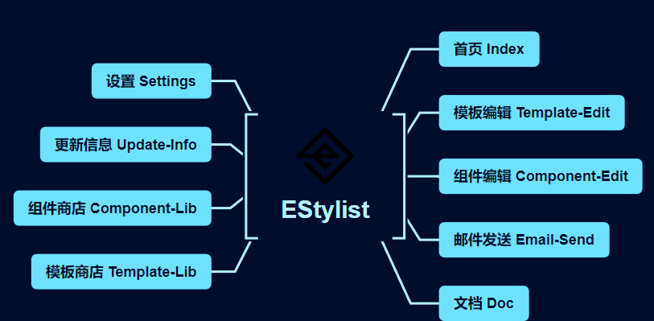

1. 首页 Index
2. 模板编辑 Template-Edit
3. 组件编辑 Component-Edit
4. 邮件发送 Email-Send
5. 文档 Doc
6. 模板商店 Template-Lib
7. 组件商店 Component-Lib
8. 更新信息 Update-Info
9. 设置 Settings

我们主要来了解一下：模板编辑、组件编辑、邮件发送、设置这四大主要功能

Let's mainly learn about the four main functions: template editing, component editing, email sending, and settings

## Settings

首先我们要了解的是设置，通过设置，我们能够更好的使用程序，并且如果您需要通过EStylist发送邮件模板则必须先了解这些设置

The first thing we need to understand is the settings. Through these settings, we can better use the program, and if you need to send email templates through EStylist, you must first understand these settings

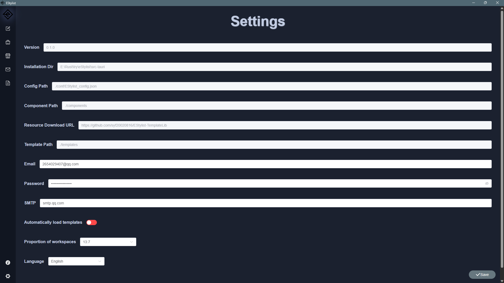

### Configurations

| Configuration         | Option | Main |
| --------------------- | ------ | ---- |
| 版本**Version** | eg: 0.0.2 | 🚫 |
| 软件安装目录**Installation Dir** | eg:E:\estylist | 🚫 |
| 配置路径 **Config Path** | ./conf/EStylist_config.json | 🚫 |
| 资源下载路径 **Resource Download URL** | https://github.com/syf20020816/EStylist-TemplateLib | 🚫 |
| 组件路径 **Component Path** | ./components | 🚫 |
| 模板路径 **Template Path** | ./templates | ❎ |
| 邮箱 **Email**    | Your SMTP Email | ✅ |
| 密码 **Password** | Your SMTP Password | ✅ |
| SMTP              | Any SMTP Service Address such as : smtp.gmail.com | ✅ |
| 自动加载模板 **Automatically load templates** | true false | ❎ |
| 工作区占比 **Proportion of workspaces** | 1:1 2:3 3:2 6:4 4:6 13:7 7:13 3:1 | ❤️ |
| 语言 Language | 中文 English | ❤️ |

>✅：important and must be configured
>
>🚫：No configuration required
>
>❎：It is not recommended to modify the configuration
>
>❤️：Please configure according to your preferences
>
>✅：重要且必须配置
>
>🚫：无需配置
>
>❎：不建议修改配置
>
>❤️：请根据您的偏好进行配置

❗请记住修改配置后请保存

❗Please remember to save after modifying the configuration

## Template-Edit

模板编辑是EStylist的核心功能，他的目的是设计出你满意的邮箱模板，或者可以是个人卡片，对于学习过CSS的用户来说可能能够快速上手，但是若你没有学过，请一定要仔细学习这个部分

Template editing is the core function of EStylist. Its purpose is to design a satisfactory email template, or it can be a personal card. For users who have studied CSS, it may be easy to get started quickly, but if you have not studied it, please carefully study this section

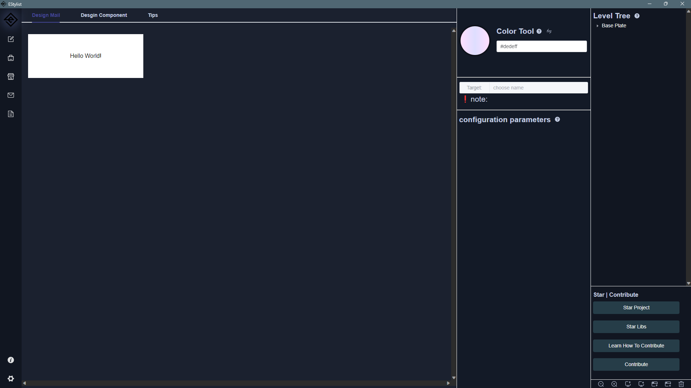

### Level Tree

EStylist核心结构为层级树，理解它你将更好的使用EStylist构建邮件模板或模板组件

The core structure of EStylist is a hierarchical tree. Understanding it, you will better use EStylist to build email templates or template components

#### Mail

EStylist的邮件模板层级树，被抽象为三层分别是：

1. 底板层：邮件底板是一个最外层容器,底板的下层是区域,所有的区域都在底板中
2. 区域层：区域是邮件底板的内部容器,区域依旧是一个容器,区域中可以存在很多组件,这些组件的外部属性是相同的
3. 组件层：组件是模板的最小构成单位,在EStylist中组件由系统组件、自定义组件、第三方组件

The email template hierarchy tree of EStylist is abstracted into three layers:

1. Base Plate：The Base Plate is the outermost container, and the lower layer of the bottom plate is the area, all of which are in the bottom plate
2. Area：The area is the internal container of the Base Plate, and it is still a container. There can be many components in the area, and their external properties are the same
3. Component：A component is the smallest constituent unit of a template, and in EStylist, a component consists of system components, custom components, and third-party components

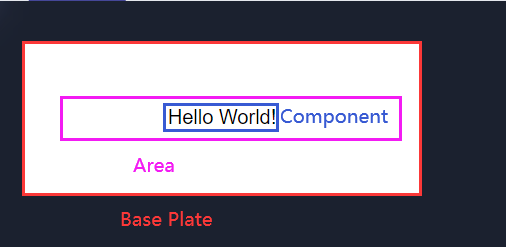

#### Component

组件其实是模板的区域层+组件层，所以它去处理底板层

The component is actually the region layer and component layer of the template, so it handles the Base Plate

### Understanding of Padding and Margins

在看配置参数之前我们首先先了解一下什么是内边距和外边距，如图：

Before looking at the configuration parameters, let's first understand what inner and outer margins are, as shown in the figure：

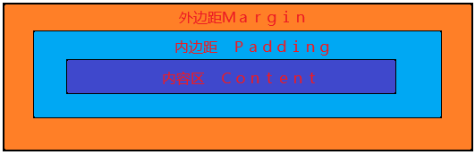

### configuration parameters

#### 底板层(Base Plate)

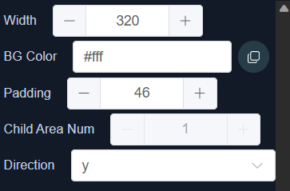

| 名称       | name           | 说明                                      | description                                                  | 值             | Value             |
| ---------- | -------------- | ----------------------------------------- | ------------------------------------------------------------ | -------------- | ----------------- |
| 宽度       | Width          | 设置底板的宽度                            | set the width of the Base Plate                              | 数字           | Number            |
| 背景色     | BG Color       | 设置底板背景颜色，使用transparent表示透明 | set the background color of the Base Plate，if use transparent means using lower layer color | 16进制颜色     | Hexadecimal color |
| 内边距     | Padding        | 内容区距离边框的宽度                      | the width of the Area from the Base Plate border             | 数字           | Number            |
| 方向       | Direction      | 设置区域按照X轴或Y轴排列                  | arrange the Area according to the X or Y axis                | 1. x 2. y | 1. x 2. y    |
| 子区域个数 | Child Area Num | 底板中包含几个区域                        | how many Areas in the Base Plate                             | 数字           | Number            |

#### 区域层(Area)

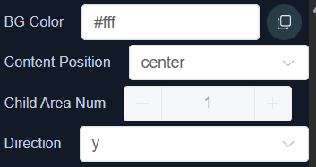

| 名称       | name             | 说明                                                         | description                                                  | 值                                                   | Value                                                |
| ---------- | ---------------- | ------------------------------------------------------------ | ------------------------------------------------------------ | ---------------------------------------------------- | ---------------------------------------------------- |
| 内容位置   | Content Position | 指的是内部组件在区域里的位置 center：居中 start：居左 end：居右 baseline == start | Refers to the position of internal components in the area center：in center start：left end：right baseline == start | 1. center 2. start 3. end 4. baseline | 1. center 2. start 3. end 4. baseline |
| 背景色     | BG Color         | 设置区域背景颜色，使用transparent表示透明                    | set the background color of the Area，if use transparent means using lower layer color | 16进制颜色                                           | Hexadecimal color                                    |
| 方向       | Direction        | 设置组件按照X轴或Y轴排列                                     | arrange theComponent according to the X or Y axis            | 1. x 2. y                                       | 1. x 2. y                                       |
| 子区域个数 | Child Area Num   | 区域中包含几个组件                                           | how many Components in the Area                              | 数字                                                 | Number                                               |

#### 组件层(Component)

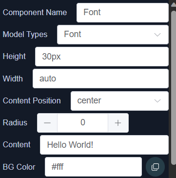

| 名称     | name             | 说明                                                         | description                                                  | 值                                                   | Value                                                |
| -------- | ---------------- | ------------------------------------------------------------ | ------------------------------------------------------------ | ---------------------------------------------------- | ---------------------------------------------------- |
| 组件名称 | Component Name   | 组件的名字                                                   | Component Name                                               | 字符串                                               | String                                               |
| 组件类型 | Model Types      | 系统组件提供的类型                                           | Types of components provided by the system                   | 1. 文字 2. 图片 3. 链接                    | 1. Font 2. Image 3. link                   |
| 高度     | Height           | 组件的高度 ，建议如下： 1. 使用`px`像素作为字体大小 2. 使用`em`作为字体大小 3. `auto`表示字体高度等于组件高度 4. 使用`%`设置高度占比 | The height of the component is recommended as follows: 1. Use `px` pixels as font size 2. Use `em` as font size 3. `auto` indicates that the font height is equal to the component height 4. Set height percentage using`%` | 字符串                                               | String                                               |
| 宽度     | Width            | 区域中包含几个组件                                           | how many Components in the Area                              | 字符串                                               | String                                               |
| 内容位置 | Content Position | 设置组件中的内容在组件中的位置 center：居中 start：居左 end：居右 baseline == start | Set the position of the content in the component within the component center：in center start：left end：right baseline == start | 1. center 2. start 3. end 4. baseline | 1. center 2. start 3. end 4. baseline |
| 圆角     | Radius           | 设置组件圆角，若组件的高度和宽度相等，使用50%表示设置组件为圆 | Set component rounded corners. If the height and width of the component are equal, use 50% to set the component as a circle | 字符串                                               | String                                               |
| 内容     | Content          | 文字内容                                                     | Text content                                                 | 字符串                                               | String                                               |
| 背景色   | BG Color         | 设置组件背景颜色，使用transparent表示透明                    | set the background color of the Component，if use transparent means using lower layer color | 16进制颜色                                           | Hexadecimal color                                    |

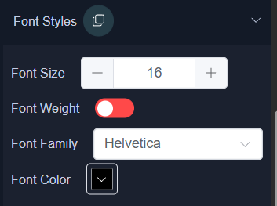

| 名称     | name        | 说明                        | description                          | 值                                                           | Value                                                        |
| -------- | ----------- | --------------------------- | ------------------------------------ | ------------------------------------------------------------ | ------------------------------------------------------------ |
| 文字大小 | Font Size   | 设置文字的大小 (单位为`px`) | Set the size of the text (unit `px`) | 数字                                                         | Number                                                       |
| 文字粗细 | Font Weight | 设置文字是否加粗            | Set whether the text is bold         | 布尔值：true \| false                                        | bool：true \| false                                          |
| 字体类型 | Font Family | 设置文字使用的字体          | Set the font used for text           | 1. Helvetica 2. Arial Narrow 3. Verdana 4. Arial 5. Franklin Gothic Medium | 1. Helvetica 2. Arial Narrow 3. Verdana 4. Arial 5. Franklin Gothic Medium |
| 文字颜色 | Font Color  | 设置文字的颜色              | Set the color of text                | 16进制颜色                                                   | Hexadecimal color                                            |

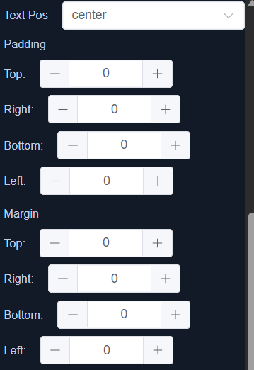

| 名称     | name     | 说明                                                         | description                                                  | 值                                                   | Value                                                |
| -------- | -------- | ------------------------------------------------------------ | ------------------------------------------------------------ | ---------------------------------------------------- | ---------------------------------------------------- |
| 文字位置 | Text Pos | 文字位置是文字在组件中占据的位置，当文字宽度大于组件宽度进行换行时会产生效果 1. left：左对齐 2. right：右对齐 3. center：居中对齐 4. justify：拉伸对齐 | Text position is the position occupied by text in a component. When the width of the text is greater than the width of the component for line wrapping, it will have an effect 1 Left: Left aligned 2 Right: Right aligned 3 Center: Center alignment 4 Justify: stretch alignment | 1. left 2. right 3. center 4. justify | 1. left 2. right 3. center 4. justify |
| 内边距   | Padding  | 内边距就是内容边框距离内容的宽度 分为上下左右四个方位   | The inner margin is the width of the content border from the content It divided into four directions: up, down, left, right | 数字                                                 | Number                                               |
| 外边距   | Margin   | 外边距就是内容边框距离区域的宽度 分为上下左右四个方位   | The margin is the width of the content border from the area It divided into four directions: up, down, left, right | 数字                                                 | Number                                               |

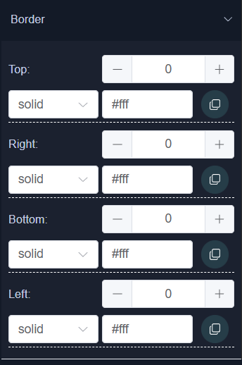

| 名称   | name | 说明                                                   | description                                                  | 值                                                           | Value                                                        |
| ------ | ---- | ------------------------------------------------------ | ------------------------------------------------------------ | ------------------------------------------------------------ | ------------------------------------------------------------ |
| Border | 边框 | 设置组件的边框，可以设置边框的宽度，边框颜色、描边类型 | Set the border of the component, which can include the width, color, and stroke type of the border | 1. 宽度：数字类型 2. 颜色：十六进制颜色 3. 描边类型：solid：实线 double：双实线 dashed：短线 dotted：点 | 1. Width: Number type 2 Color: hexadecimal color 3 Stroke type: solid: solid line double: double solid line dashed: short line dotted: point |

#### 链接和图片 Link and Image

当我们切换组件类型为链接或图片时会增加一个属性：地址
When we switch the component type to Link or Image, we will add an attribute: Url

| 名称         | name         | 说明                                                   | description                                                  | 值     | Value  |
| ------------ | ------------ | ------------------------------------------------------ | ------------------------------------------------------------ | ------ | ------ |
| 地址（图片） | Url（Image） | 表示图片的base64值，在上传图片之后就会显示，请不要更改 | Indicates the base64 value of the image, which will be displayed after uploading the image. Please do not change it | 字符串 | String |
| 地址（链接） | Url（Link）  | 表示链接要跳转的地址，请直接输入                       | Indicates the address to which the link will jump, please enter it directly | 字符串 | String |

### 工具（tools）

工具在右下角，当前一共有7种

The tools are in the bottom right corner, currently there are a total of 7 types

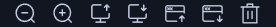

| tool | des                                                          |
| ---- | ------------------------------------------------------------ |
| 1    | 缩小模板编辑区 Zoom out the template editing area       |
| 2    | 放大模板编辑区 Zoom in the template editing area        |
| 3    | 上传JSON模板文件到邮件设计中 Upload JSON template file to email design |
| 4    | 下载邮件模板的JSON文件以及HTML文件到templates目录中 Download the JSON file and HTML file of the email template to the templates directory |
| 5    | 上传JSON模板文件到组件设计中 Upload JSON template files into component design |
| 6    | 下载组件模板的JSON文件以及HTML文件到components目录中 Download the JSON file and HTML file of the component template to the components directory |
| 7    | 删除当前模板以及暂存区缓存 Delete the current template and temporary storage cache |

> ❗上传文件时请不要焦急，为了完整的解析文件程序会等待0.75s左右的时间，请不要手动关闭，程序解析结束会自动关闭
>
> ❗Please do not be anxious when uploading files. In order to fully parse the file, the program will wait for about 0.75 seconds. Please do not manually close it. The program will automatically close after parsing

## Email-Send

最后是邮件发送，值得注意的是EStylist旨在发送构建好的邮件模板，若你想要发送寻常的邮件，请移步到普通邮箱

Finally, there is email sending. It is worth noting that EStylist aims to send built email templates. If you want to send regular emails, please move to regular email

### Buttons

| button      | des                                                          |
| ----------- | ------------------------------------------------------------ |
| Choose      | 选择你需要发送的模板 Choose the template you need to send |
| Send        | 发送邮件 Send Email                                     |
| Add Contact | 添加联系人邮件 Add contact email                        |

